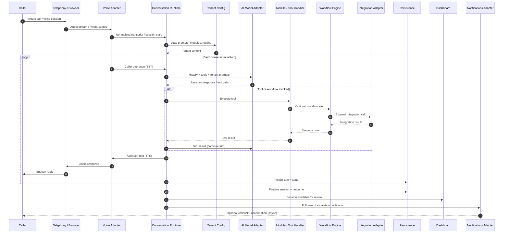

# Call Flow

## Phase 1 Text Simulation Flow

Phase 1 implements a reduced text-only path for architecture validation:

```
browser text input (/demo, fictional dental tenant only)
  → POST /api/conversations/messages
  → composition root (wires MockAIProvider today)
  → conversation runtime (depends on AIProvider interface)
  → MockAIProvider
  → optional mock tool execution (check_availability)
  → in-memory persistence
  → structured JSON response
  → browser transcript update
```

**Wiring notes:**

- `AIProvider` enables future substitution without rewriting runtime orchestration.
- Provider selection via environment variables or tenant configuration is **not** implemented yet; `src/lib/conversation-service.ts` hard-wires `MockAIProvider`.
- Voice and telephony adapters are Phase 2+ placeholders (`.gitkeep` only).
- The `/demo` UI uses `fictional-dental-clinic` only; multi-tenant UI selection is a possible later demo enhancement.

Phase 1 does **not** include telephony, browser audio, external AI APIs, workflows, dashboard review, analytics, or notifications.

## Target Flow (Full Platform)

This document describes the generic end-to-end flow for a voice conversation on the platform. Provider names are illustrative; the flow is adapter-neutral.

## Flow Summary

```
caller
  → telephony or browser voice channel
  → voice transport / provider adapter
  → conversation runtime
  → AI model adapter
  → tool / workflow execution
  → persistence
  → dashboard, analytics, notifications, and follow-up
```

## Stage Descriptions

### 1. Caller initiates contact

The caller connects via:

- **Telephony channel** — inbound phone call routed through a telephony provider to a webhook/media endpoint.
- **Browser voice channel** — WebRTC or similar browser-based audio for demos and embedded widgets.

### 2. Voice transport / provider adapter

The voice adapter:

- Receives audio stream or encoded audio chunks
- Performs speech-to-text (STT) or receives transcript events from the provider
- Sends text-to-speech (TTS) audio back to the channel
- Normalizes provider-specific events into platform session events

### 3. Conversation runtime

The runtime:

- Creates or resumes a conversation session
- Loads tenant configuration (prompts, modules, routing rules)
- Maintains turn history and session state
- Orchestrates each conversational turn

### 4. AI model adapter

For each turn, the runtime invokes the AI adapter with:

- System and tenant prompts
- Conversation history
- Available tools (from enabled modules)
- Tenant-specific constraints (tone, language, escalation triggers)

The adapter returns assistant text and optional tool-call requests.

### 5. Tool / workflow execution

When the AI requests a tool or a workflow trigger fires:

- The runtime dispatches to the appropriate module handler or workflow engine
- Workflows may call integrations (calendar, CRM, notifications)
- Results are fed back to the AI for the next turn or used to end the session

### 6. Persistence

Throughout and after the session:

- Session metadata, turns, and outcomes are stored
- Transcripts are persisted with redaction rules applied
- Lead, appointment, or support records are created as module outputs

### 7. Dashboard, analytics, notifications, follow-up

Post-turn and post-session:

- Analytics events are emitted (latency, completion, module usage)
- Operators can review sessions in the dashboard
- Follow-up module or workflows trigger notifications (email, SMS, webhook)
- Escalations appear in the operator queue

## Sequence Diagram



## Error and Escalation Paths

| Condition | Behavior |
|-----------|----------|
| Voice adapter failure | Runtime logs error; caller hears fallback message; session marked degraded |
| AI adapter timeout | Retry with backoff; escalate to human routing if configured |
| Tool / integration failure | AI informed of failure; workflow may branch to escalation step |
| After-hours caller | Tenant routing rules apply (voicemail, callback offer, emergency line) |
| Explicit escalation request | Runtime triggers handoff workflow; notification to operator |

## Related Documents

- [Target Architecture](TARGET-ARCHITECTURE.md)
- [Tenant Configuration](TENANT-CONFIGURATION.md)
- [Deployment Models](DEPLOYMENT-MODELS.md)
