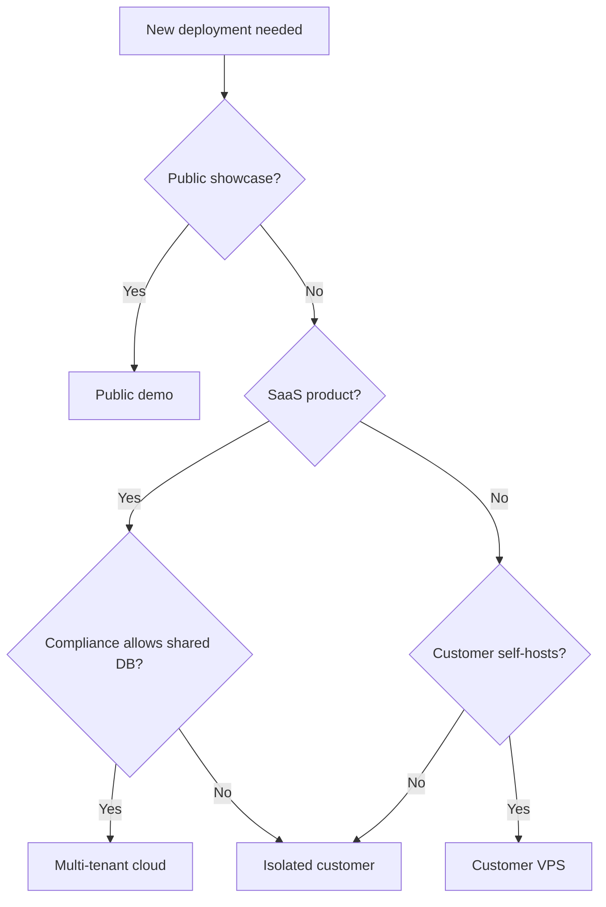

# Deployment Models

The platform supports four deployment models. All models run the same modular monolith application; they differ in hosting, tenancy isolation, and operational responsibility.

## Model Comparison

| Model | Isolation | Operator | Best for |
|-------|-----------|----------|----------|
| Public demo | Shared, sandbox data | Platform team | Recruiters, prospects, open-source evaluators |
| Shared multi-tenant cloud | Logical tenant isolation | Platform team | SaaS offering, many small customers |
| Isolated customer deployment | Dedicated instance + DB | Platform or customer ops | Mid-market, compliance-sensitive |
| Customer-managed VPS | Full customer control | Customer IT | Regulated industries, self-hosting preference |

---

## 1. Public Demo Deployment

### Description

A shared, internet-accessible deployment with fictional tenant configuration, browser voice channel, and read-only or sandbox dashboard. No real telephony or customer data.

### Advantages

- Low cost to operate
- Safe showcase for architecture and UX
- Fast iteration on documentation and screenshots

### Risks

- Must strictly prevent demo abuse (rate limits, no real PII input)
- Shared resources — not representative of production SLAs
- Credential exposure if sandbox keys are misconfigured

### Appropriate use cases

- Portfolio and recruiter demonstrations
- Conference demos and proof-of-concept walkthroughs
- Community evaluation of the open-source boilerplate

### Configuration notes

- `deployment.profile: demo`
- Fictional tenants only
- Recording and transcript storage optional or disabled
- Strict CORS and rate limiting

---

## 2. Shared Multi-Tenant Cloud Deployment

### Description

Single application cluster serving multiple tenants with logical isolation (`tenant_id` on all records, tenant-scoped config loading, row-level security in database).

### Advantages

- Efficient resource utilization
- Centralized upgrades and monitoring
- Faster onboarding — new tenant is config + secrets, not new infrastructure

### Risks

- Noisy neighbor and blast-radius concerns require strong isolation testing
- Configuration bugs could leak data across tenants
- Compliance requirements may prohibit shared infrastructure for some customers

### Appropriate use cases

- SaaS product with many small business customers
- Standard receptionist and appointment use cases
- Customers without strict data residency requirements

### Configuration notes

- `deployment.profile: cloud-multi-tenant`
- Tenant config loaded from secure store per request/session
- Database row-level security enforced
- Per-tenant secret namespaces in secrets manager

---

## 3. Isolated Customer Deployment

### Description

Dedicated application instance and database per customer, managed by the platform operator. Customer-specific config, secrets, and optional custom domain.

### Advantages

- Strong isolation without customer managing infrastructure
- Easier compliance narrative (single-tenant data store)
- Customer-specific upgrades and maintenance windows

### Risks

- Higher per-customer operational cost
- Slower onboarding than multi-tenant
- Patch and version drift across customer fleet

### Appropriate use cases

- Mid-market customers with moderate compliance needs
- Customers requiring dedicated phone numbers and branding
- Pilots before customer-managed migration

### Configuration notes

- `deployment.profile: isolated`
- Single tenant config per deployment
- Secrets in customer-scoped secrets manager path
- Telephony webhooks point to customer-specific URL

---

## 4. Customer-Managed Linux / VPS Deployment

### Description

Customer provisions and operates their own Linux server or VPS. Platform team delivers deployment package (container image or release artifact), documentation, and optional setup automation.

### Advantages

- Maximum data control for customer
- Suitable for air-gapped or regional hosting requirements
- Customer owns backup, network, and access policies

### Risks

- Customer skill variance — support burden increases
- Delayed security patching if customer ops are slow
- Integration credential management falls to customer

### Appropriate use cases

- Regulated industries (healthcare, legal, finance) with self-hosting policies
- Geographic data residency requirements
- Customers with existing VPS or private cloud standards

### Configuration notes

- `deployment.profile: vps`
- `.env` or local secrets manager on customer server
- Customer provides PostgreSQL, TLS certificates, reverse proxy
- Telephony and AI provider accounts owned by customer

---

## Choosing a Model



## Migration Path

Deployments can progress:

```
Demo → Isolated pilot → Multi-tenant (if SaaS) or VPS (if self-host)
```

Tenant configuration format remains stable across models; only infrastructure and secret management change.

## Related Documents

- [Tenant Configuration](TENANT-CONFIGURATION.md)
- [Secrets and Data Protection](../security/SECRETS-AND-DATA-PROTECTION.md)
- [Implementation Roadmap](../roadmap/IMPLEMENTATION-ROADMAP.md)
