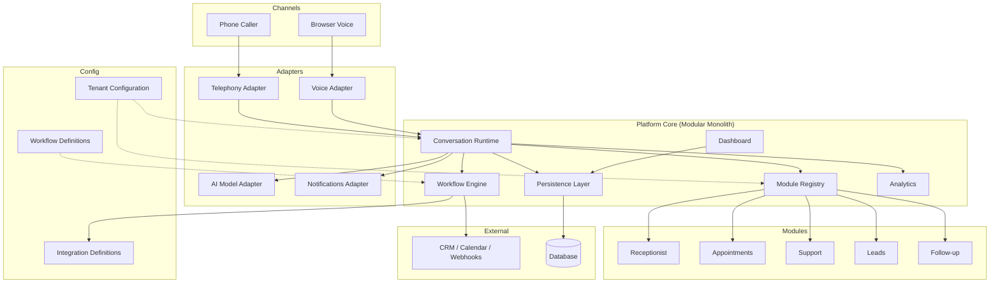

# Target Architecture

## Phase 1 Implementation Status

Phase 1 delivers a **text-based conversation simulator** inside a Next.js modular monolith (completed **2026-08-03**). The following are implemented:

| Area | Phase 1 status |
|------|----------------|
| `src/core` | Conversation runtime, types (including `AIProvider`), tool registry |
| `src/adapters/ai` | `MockAIProvider` only; wired by composition root (`src/lib/conversation-service.ts`) |
| `src/adapters/voice` | Placeholder only (`.gitkeep`); interface and browser audio are Phase 2 |
| `src/adapters/telephony` | Placeholder only (`.gitkeep`); Phase 6 |
| `src/adapters/notifications` | Placeholder only (later phase) |
| `src/tenants` | Static YAML tenant loader (dental + home-services) |
| `src/persistence` | In-memory conversation repository |
| `src/app` | API route + `/demo` text simulator (dental tenant only in UI) |
| `src/modules/*` | Placeholder directories only |
| `src/workflows` | Not implemented (Phase 5) |
| `src/integrations` | Not implemented (Phase 5) |
| `src/dashboard` | Not implemented (Phase 3) |
| `src/analytics` | Not implemented (Phase 3) |

**Provider wiring today:** `ConversationRuntime` depends on the `AIProvider` interface. The composition root currently constructs and injects `MockAIProvider`. Environment- or tenant-configuration-based provider selection is **not** implemented yet; substitution requires a code change at the composition root.

No database SDK, authentication layer, or external AI/voice SDK is included in Phase 1. Voice and telephony remain Phase 2+ placeholders.

## Recommendation: Modular Monolith

The initial implementation should be a **modular monolith** — a single deployable application with clearly bounded internal modules and adapter interfaces. This approach:

- Minimizes operational overhead for early deployments and demos
- Keeps latency low for real-time voice conversations
- Allows clean extraction into services later if scale demands it
- Avoids premature distributed-system complexity

Split into separate services only when a specific boundary has independent scaling, deployment, or team ownership requirements.

## Top-Level Source Layout

```
src/
├── core/              Conversation runtime and orchestration
├── adapters/          Provider implementations (voice, AI, telephony, notifications)
├── modules/           Optional business capabilities (receptionist, appointments, …)
├── tenants/           Tenant config loading, validation, and resolution
├── workflows/         Workflow engine and step execution
├── integrations/      External system connectors
├── persistence/       Database access, repositories, migrations
├── analytics/         Metrics, events, and reporting hooks
└── dashboard/         Admin UI and API for operators
```

## Folder Responsibilities

### `src/core`

The stable heart of the platform.

- Conversation session lifecycle (start, turn, end)
- Turn orchestration: receive input → invoke AI → execute tools → produce output
- Adapter registry and dependency injection
- Module registry and dispatch
- Error handling, timeouts, and graceful degradation
- Event emission to analytics and persistence

**Must not contain:** customer branding, industry-specific prompts, or hardcoded integration logic.

### `src/adapters`

Provider-specific implementations behind stable interfaces.

```
adapters/
├── voice/          STT, TTS, and real-time audio transport
├── ai/             LLM completion, function calling, streaming
├── telephony/      Inbound/outbound call handling, webhooks, media streams
└── notifications/  Email, SMS, push, webhook delivery
```

Each adapter implements a provider-neutral contract defined in or referenced by `core`. **Target design:** the composition root selects adapters based on environment variables and tenant configuration — never by importing vendor SDKs directly in `core` or `modules`. **Phase 1 reality:** only `MockAIProvider` is wired; config-driven selection is deferred.

### `src/modules`

Optional business capabilities enabled per tenant.

```
modules/
├── receptionist/   Greeting, FAQ, routing
├── appointments/   Scheduling flows and calendar handoff
├── support/        Issue triage and escalation
├── leads/          Capture, scoring, CRM handoff
└── follow-up/      Post-call tasks and notifications
```

Modules register tools, prompts fragments, and workflow triggers with the core. They do not modify core source code.

### `src/tenants`

Configuration loading and resolution.

- Load tenant YAML/JSON from filesystem or remote store
- Validate against `schemas/tenant-config.schema.json`
- Resolve inheritance (base profile → tenant overrides)
- Expose typed tenant context to runtime and modules

### `src/workflows`

Multi-step business process execution.

- Parse workflow definitions (YAML/JSON)
- Execute steps: conditions, tool calls, integration invocations, delays
- Emit events for dashboard and analytics
- Validate against `schemas/workflow.schema.json`

### `src/integrations`

External system connectors invoked by workflows and modules.

- CRM, calendar, ticketing, custom webhooks
- Each integration implements a connector interface
- Credentials resolved from environment/secrets store, never from committed config
- Validate against `schemas/integration.schema.json`

### `src/persistence`

Data access layer.

- Conversation sessions, turns, transcripts (redacted where configured)
- Call outcomes, lead records, appointment holds
- Tenant-agnostic schema with tenant_id isolation
- Migration management

### `src/analytics`

Operational and product metrics.

- Session events, latency, completion rates
- Module and workflow funnel metrics
- Export hooks for external observability platforms

### `src/dashboard`

Administrative interface for operators and agent administrators.

- Session list, detail, transcript review
- Configuration preview (read-only in demo; editable in managed deployments)
- Follow-up queue and escalation inbox
- Authentication and role-based access

## Adapter Boundaries

```
┌──────────────┐     ┌─────────────────┐     ┌──────────────────┐
│   Core       │────▶│ Adapter Interface│◀────│ Adapter Impl A   │
│   Runtime    │     │  (stable contract)│     │ (e.g. Provider X)│
└──────────────┘     └─────────────────┘     └──────────────────┘
                              ▲
                              │
                     ┌──────────────────┐
                     │ Adapter Impl B   │
                     │ (e.g. Provider Y)│
                     └──────────────────┘
```

Rules:

1. Core and modules depend only on adapter **interfaces**, never on vendor SDKs.
2. Adapter selection is configuration-driven (`AI_PROVIDER`, `VOICE_PROVIDER`, etc.).
3. Adapters translate provider-specific responses into platform-neutral types.
4. Adding a new provider means adding an adapter implementation — no core changes.

## Module Boundaries

```
Tenant Config ──▶ Module Registry ──▶ Enabled Modules
                         │
                         ▼
              ┌──────────────────────┐
              │  Core Runtime        │
              │  (dispatches tools) │
              └──────────────────────┘
                         │
         ┌───────────────┼───────────────┐
         ▼               ▼               ▼
   receptionist    appointments        leads
```

Rules:

1. Modules are opt-in via tenant configuration (`enabled_modules`).
2. Modules register capabilities at startup; they do not patch core behavior.
3. Cross-module coordination happens through workflows and events, not direct imports between modules where avoidable.
4. Disabling a module must not break the runtime for other modules.

## Creating Customer Deployments Without Modifying Core

New customer deployments follow this pattern:

1. **Copy or author tenant configuration** — `tenants/<customer-slug>.yaml` based on an example or base profile.
2. **Author prompts and knowledge** — customer-specific files in tenant config paths, not in `src/`.
3. **Enable modules** — set `enabled_modules` for required business capabilities.
4. **Define integrations and workflows** — reference integration and workflow schema-compliant files.
5. **Set environment variables** — provider credentials and deployment settings via `.env` or secrets manager.
6. **Deploy** — same application binary/image; different config and secrets per deployment.

No changes to `src/core` are required for a new customer unless they need a genuinely new platform capability (which becomes a new module or adapter, contributed back to the platform).

## Component Diagram



## Related Documents

- [Call Flow](CALL-FLOW.md)
- [Tenant Configuration](TENANT-CONFIGURATION.md)
- [Deployment Models](DEPLOYMENT-MODELS.md)
