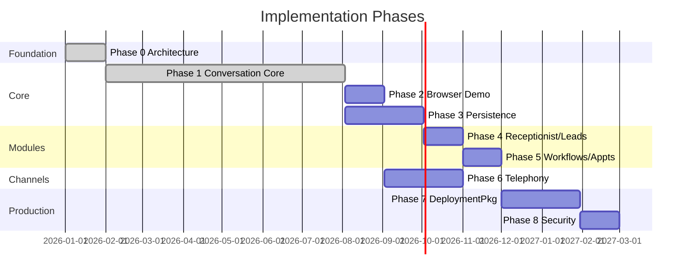

# Implementation Roadmap

Phased delivery plan for the AI Voice Receptionist platform. Each phase builds on prior deliverables. No phase includes copying proprietary production code.

---

## Phase 0 — Repository and Architecture Foundation

**Objective:** Establish public repository structure, documentation, schemas, and fictional examples as the contract for all future implementation.

**Expected deliverables:**

- Repository layout (`docs/`, `examples/`, `schemas/`, `src/` skeleton)
- Architecture and security documentation
- JSON Schema drafts (v0.1) for tenant, workflow, and integration config
- Fictional tenant and workflow examples
- README, LICENSE, `.gitignore`, `.env.example`

**Dependencies:** None.

**Completion criteria:**

- All documentation reviewed and internally consistent
- Schemas validate example files
- Public repository policy acknowledged by contributors
- No application code or installed dependencies

**Major risks:**

- Documentation drift if not updated as implementation proceeds
- Schema too rigid or too loose for real tenant needs

**Status:** Complete (Phase 0 review passed).

---

## Phase 1 — Provider-Neutral Conversation Core

**Objective:** Implement the minimal conversation runtime with a provider-neutral AI contract and a text-based mock path for local development.

**Expected deliverables:**

- `src/core` session lifecycle and turn orchestration
- Provider-neutral `AIProvider` interface in `src/core/types`
- Stub or mock AI adapter implementation for local development
- Unit tests for runtime orchestration (no vendor SDKs required for CI)

**Dependencies:** Phase 0 schemas and architecture docs.

**Completion criteria:**

- Text-based conversation loop works with the mock AI provider
- Runtime depends on the `AIProvider` interface (not a vendor SDK)
- Tenant config loads and supplies branding/prompts to runtime

**Major risks:**

- Over-coupling runtime to first adapter implementation
- Premature abstraction making adapters hard to implement

**Status:** Complete (2026-08-03).

**Implemented in Phase 1:**

- Next.js App Router application shell (`src/app`)
- `ConversationRuntime.handle()` orchestration
- Core contracts in `src/core/types`, including `AIProvider`
- `MockAIProvider` (deterministic, no external AI calls), wired by the composition root (`src/lib/conversation-service.ts`)
- `InMemoryConversationRepository`
- `StaticTenantConfigRepository` (loads fictional YAML tenants)
- `check_availability` mock tool and tool registry
- `POST /api/conversations/messages`
- Text simulation demo at `/demo` (fictional dental tenant only)
- Vitest tests for runtime orchestration, request validation, mock AI intents, and direct `check_availability` unit coverage (plus runtime-level tool invocation coverage)

**Clarifications:**

- Provider interfaces exist so a future AI adapter can substitute for `MockAIProvider` without rewriting core runtime logic.
- Config-driven provider selection (environment variables or tenant configuration) is **not** implemented in Phase 1; the composition root hard-wires `MockAIProvider`.
- Browser voice adapter interface, browser audio, and voice channel work are Phase 2 — not Phase 1.
- Multi-tenant selection in the demo UI is a possible later demo enhancement (not required for Phase 1 closeout).

**Deferred from original Phase 1 scope:**

- Browser voice adapter interface and browser audio (Phase 2)
- Config-driven AI/voice provider selection
- Real LLM provider integration
- Database persistence, authentication, analytics, telephony

---

## Phase 2 — Browser Voice Demo

**Objective:** Deliver a public-demo-capable browser voice channel for fictional tenant showcase.

**Expected deliverables:**

- Voice adapter interface under `src/adapters/voice`
- Browser voice channel integration (browser audio / STT–TTS path) via the voice adapter
- Demo deployment configuration (`deployment.profile: demo`)
- Rate limiting and abuse prevention for public endpoint
- Landing page or embeddable widget (minimal UI)

**Dependencies:** Phase 1 conversation core.

**Completion criteria:**

- End-to-end voice conversation in browser with fictional tenant
- No telephony required for demo
- Session appears in logs (persistence optional at this phase)

**Major risks:**

- Browser audio compatibility across devices
- Public demo cost control (AI/voice API usage)

---

## Phase 3 — Persistence and Operations Dashboard

**Objective:** Store sessions and provide operators a dashboard to review conversations.

**Expected deliverables:**

- `src/persistence` with PostgreSQL schema and migrations
- Session, turn, and outcome repositories
- `src/dashboard` read-only session list and detail views
- Authentication for dashboard access
- Basic analytics events in `src/analytics`

**Dependencies:** Phase 1 core; Phase 2 optional for demo data.

**Completion criteria:**

- Sessions persist across restarts
- Operator can log in and review transcript with redaction
- Tenant isolation enforced in queries

**Major risks:**

- Schema changes requiring painful migrations later
- Insufficient redaction defaults exposing PII in dashboard

---

## Phase 4 — Receptionist and Lead Qualification

**Objective:** Implement first business modules with fictional tenant configurations.

**Expected deliverables:**

- `src/modules/receptionist` — greeting, routing, FAQ tools
- `src/modules/leads` — capture and scoring tools
- Module registry integration with core
- Updated fictional tenant examples exercising both modules

**Dependencies:** Phase 1 core; Phase 3 persistence (for lead records).

**Completion criteria:**

- Fictional dental clinic demo handles receptionist + lead flows
- Modules disable cleanly when not in `enabled_modules`
- Call outcomes and lead records visible in dashboard

**Major risks:**

- Module logic leaking into core
- Qualification scoring too tenant-specific; needs config-driven rules

---

## Phase 5 — Appointment and Workflow Engine

**Objective:** Implement workflow engine and appointment booking module with calendar integration adapter.

**Expected deliverables:**

- `src/workflows` engine (step types: condition, tool, integration, delay)
- `src/modules/appointments` booking flows
- `src/integrations` calendar connector interface + mock implementation
- Appointment booking workflow example fully executable

**Dependencies:** Phase 4 modules; Phase 3 persistence.

**Completion criteria:**

- Fictional appointment booking completes with mock calendar
- Workflow validated against `workflow.schema.json`
- Failed integration steps trigger configured escalation path

**Major risks:**

- Workflow engine complexity growing beyond modular monolith scope
- Calendar integration variations across providers

---

## Phase 6 — Telephony Integration

**Objective:** Add inbound phone call support via telephony adapter.

**Expected deliverables:**

- `src/adapters/telephony` interface and first provider implementation
- Webhook handlers for call events and media streams
- Bridge from telephony media to voice adapter
- Telephony-specific tenant config (numbers, webhook URLs — fictional in repo)

**Dependencies:** Phase 2 voice path; Phase 1 core.

**Completion criteria:**

- Inbound call to configured number completes conversation
- Telephony adapter swappable via configuration
- Call metadata persisted with session

**Major risks:**

- Real-time media latency and quality
- Webhook security (signature validation, replay protection)
- Telephony costs during development and testing

---

## Phase 7 — Tenant Configuration and Deployment Packaging

**Objective:** Production-ready configuration loading, validation, and deployment artifacts for all four deployment models.

**Expected deliverables:**

- `src/tenants` loader with inheritance and schema validation
- CI validation step for tenant and workflow files
- Deployment guides and Docker/container packaging
- Environment-specific overlay support
- Multi-tenant config resolution (for cloud model)

**Dependencies:** Phases 1–6 feature-complete modules.

**Completion criteria:**

- New fictional tenant deployable without code changes
- All four deployment models documented with runnable paths
- Schema validation fails CI on invalid config

**Major risks:**

- Configuration inheritance bugs causing wrong tenant behavior
- Deployment package divergence across models

---

## Phase 8 — Security Hardening and Production Readiness

**Objective:** Harden platform for production customer deployments.

**Expected deliverables:**

- Secret management integration patterns per deployment model
- Transcript and recording protection controls enforced
- Log redaction verified by automated tests
- Rate limiting, auth hardening, dependency audit process
- Operational runbooks (backup, restore, incident response)
- Performance and load testing baseline

**Dependencies:** All prior phases.

**Completion criteria:**

- Security checklist passed for isolated deployment model
- No secrets in repository verified by CI scanning
- Penetration test or security review completed (scope TBD)
- SLA-oriented monitoring and alerting documented

**Major risks:**

- Undiscovered cross-tenant isolation vulnerability
- Compliance requirements (HIPAA, GDPR) needing additional controls not yet scoped

---

## Roadmap Summary

Phase 0 and Phase 1 are complete. Phase 1 closed on **2026-08-03**. Remaining timeline bars are illustrative; actual dates require team approval.

## Related Documents

- [Platform Overview](../architecture/PLATFORM-OVERVIEW.md)
- [Target Architecture](../architecture/TARGET-ARCHITECTURE.md)
- [Deployment Models](../architecture/DEPLOYMENT-MODELS.md)
