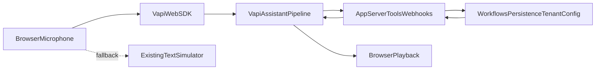

# Phase 2 — Browser Voice Plan (Vapi Primary)

Planning document for optional browser voice around the Phase 1 conversation core, with **Vapi as the primary voice provider** for browser demos and future telephone channels.

**Status:** In progress — Tasks **2.1–2.2 complete**. Next authorized planning task is **Task 2.3 (Vapi integration architecture and security design)**. Tasks 2.4+ are not authorized by this document alone.

**Related:** [Implementation Roadmap](IMPLEMENTATION-ROADMAP.md)

**Documentation-only revision notice:** This document was revised to adopt Vapi as the primary voice path. It does **not** authorize installing `@vapi-ai/web`, implementing adapters, or changing demo UI until an explicit follow-up task is approved.

---

## 1. Objective

Add optional browser-based voice interaction without embedding proprietary business logic in Vapi and without coupling core business modules to a single vendor SDK.

### Phase 1 text flow (preserved)

```
Browser text input
  → POST /api/conversations/messages
  → ConversationRuntime
  → MockAIProvider
  → optional tool execution
  → assistant text response
```

Text mode remains fully functional on `/demo`.

### Target Phase 2 browser voice flow (Vapi primary)

```
Browser microphone
  → Vapi Web SDK
  → configured Vapi assistant voice pipeline
  → application server tools / webhooks
  → business workflows and persistence (this application)
  → Vapi response audio
  → browser playback
```

### Future telephone flow (same application ownership)

```
Phone number or SIP
  → Vapi
  → same assistant configuration and application tools / webhooks
  → business workflows and persistence (this application)
```

Telephony enablement is planned through Vapi later; Phase 2 browser work must not hard-code a separate proprietary phone stack into core business logic.

---

## 2. Architecture principles

| Principle | Requirement |
|-----------|-------------|
| Vapi primary | Vapi is the primary browser and future telephone voice provider |
| Provider-neutral contracts retained | Existing `src/core/voice` contracts remain valuable for adapters and fallbacks |
| Browser STT is reference-only | `BrowserSpeechToTextProvider` remains an **experimental fallback / reference** adapter |
| No browser-native TTS now | Do **not** implement a browser-native `TextToSpeechProvider` as the Phase 2 primary path |
| Next implementation | Vapi voice adapter using the official Web SDK (after Task 2.3 design) |
| Application owns business logic | Tools, tenant configuration, workflows, persistence, and dashboard logic remain owned by this application |
| No proprietary logic in Vapi | Vapi must not become the location of proprietary business rules, prompts-as-product IP, or customer-specific workflows |
| Credential safety | Private Vapi credentials must never be exposed in the browser |
| Public key only in client | Only the appropriate public Web SDK key may be client-visible |
| Server-side sensitive config | Assistant creation and sensitive configuration are handled server-side or through secure configuration |
| Text preservation | `/demo` text simulator remains fully usable |
| Fictional demo only | Phase 2 uses the fictional dental-clinic tenant only |



### Relationship to earlier browser-native plan

Tasks 2.1–2.2 delivered provider-neutral contracts and a browser-native STT reference adapter. The earlier plan that treated browser STT→API→browser TTS as the primary Phase 2 path is **superseded**. Browser-native TTS is **not** the approved next implementation.

### Relationship to the broader roadmap

[IMPLEMENTATION-ROADMAP.md](IMPLEMENTATION-ROADMAP.md) Phase 2 also mentions demo deployment packaging, rate limiting, and widgets. Those remain deferred until the Vapi browser path works on `/demo`.

---

## 3. Contracts and completed reference work

### Task 2.1 — complete

Provider-neutral contracts live in `src/core/voice/types.ts`. Browser capability detection lives in `src/adapters/voice/browser-capabilities.ts`.

These contracts remain the shared vocabulary for voice session state, errors, and future adapter interfaces (including Vapi).

### Task 2.2 — complete (reference / experimental fallback)

`BrowserSpeechToTextProvider` (`src/adapters/voice/browser-speech-to-text.ts`) is retained as an experimental fallback and reference implementation of `SpeechToTextProvider`. It is **not** the primary Phase 2 voice path.

### Not approved as primary path

- Browser-native `TextToSpeechProvider` implementation is **not** the next task and must not be treated as Phase 2 primary delivery.
- Direct browser STT → `POST /api/conversations/messages` → browser TTS is no longer the target primary architecture.

### Contract inventory (still valid)

- `SpeechToTextProvider`
- `TextToSpeechProvider` (interface may remain for fallbacks; Vapi path is primary)
- `VoiceCapability`
- `VoiceSessionState`
- `VoiceError` / `VoiceProviderError`

`VoiceCapability` continues to include `mediaCapture`. Microphone permission remains `"unknown"` until a later task explicitly queries or requests it.

---

## 4. Responsibility matrix

| Concern | Vapi | Browser frontend | Application backend | Tenant configuration | Persistence / dashboard |
|---------|------|------------------|---------------------|----------------------|-------------------------|
| Microphone capture & realtime audio | Primary transport via Web SDK | Starts/stops call UI; renders status | Does not handle raw audio streams in Phase 2 | N/A | N/A |
| STT / TTS / turn-taking voice pipeline | Owns realtime voice pipeline | Plays/receives audio through SDK | Does not re-implement primary STT/TTS | May supply language/voice preferences as config inputs | N/A |
| Assistant model / spoken dialogue | Executes configured assistant | Displays transcripts/status | Supplies secure config / tool results; does not leak private keys | Public-safe branding and module flags | Stores outcomes when persistence exists |
| Business tools & workflows | Invokes app webhooks/tools only | May show tool events already returned by app APIs | **Owns** tool auth, validation, execution | Enables modules / tool allow-lists | Persists tool outcomes |
| Proprietary business logic | Must **not** host proprietary logic | Must **not** embed secrets or proprietary rules | **Owns** proprietary logic | Config only (fictional in public repo) | Operational records |
| Tenant resolution | Must not be trusted from raw caller claims alone | Passes demo tenant context only as allowed | Resolves and validates tenant server-side | Source of fictional tenant YAML/config | Tenant-scoped queries later |
| Persistence | Optional call metadata provider; not system of record for app domain | In-memory UI transcript for demo | Owns repositories / future DB | N/A | Future dashboard reads app persistence |
| Credentials | Public Web key in client; private API key server-only | May hold public key only | Holds private keys and webhook secrets | No secrets in example YAML | N/A |

---

## 5. Target flows

### 5.1 Browser demo flow

1. User opens `/demo` (fictional dental tenant; text simulator still available).
2. User starts a Vapi browser call via Web SDK (explicit user action).
3. Vapi handles mic permissions, streaming audio, STT/TTS, and assistant turn-taking.
4. When tools are needed, Vapi calls application webhooks/tools.
5. Application validates inputs, resolves tenant securely, executes business logic, returns tool results.
6. Vapi continues the spoken conversation and plays audio in the browser.
7. Demo UI shows status/transcript cues as available without becoming the business-logic engine.

### 5.2 Future telephone flow

1. Caller dials a Vapi-managed or imported number/SIP endpoint.
2. Vapi connects the call to the same assistant configuration pattern.
3. Same application tools/webhooks execute business workflows and persistence.
4. No duplicate proprietary phone business logic is introduced in core modules.

---

## 6. Security requirements

| Requirement | Detail |
|-------------|--------|
| No private API keys in client | Never expose a Vapi private API key in browser bundles, client env vars, or public examples |
| Isolate env vars | Separate public Web SDK key vars from private server secrets (distinct names, server-only loading) |
| Webhook authenticity | Verify incoming Vapi webhook authenticity using the supported Vapi mechanism before executing tools |
| Tool input validation | Validate and sanitize all tool arguments server-side |
| Do not trust caller tenant IDs | Resolve tenant from trusted server configuration / signed context; never trust raw client-supplied tenant identity alone |
| Log redaction | Redact transcripts, call payloads, and PII-like fields in logs |
| Recordings default off | Recordings disabled by default for the public demo |
| Fictional tenant only | Phase 2 uses fictional demo data only |
| Assistant secrecy | Sensitive prompts/config stay server-side or in secured config; public repo keeps fictional examples only |

### Environment-variable design (to be detailed in Task 2.3)

Illustrative split (names finalized in Task 2.3):

| Variable class | Visibility | Examples (illustrative) |
|----------------|------------|-------------------------|
| Public Web SDK key | Client-safe | `NEXT_PUBLIC_VAPI_PUBLIC_KEY` |
| Private API key | Server-only | `VAPI_PRIVATE_API_KEY` |
| Webhook secret | Server-only | `VAPI_WEBHOOK_SECRET` |
| Assistant ID / config refs | Prefer server-only | `VAPI_ASSISTANT_ID` |
| Feature flags | Mixed | e.g. enable Vapi demo voice |

Task 2.3 must produce the concrete env matrix before installing `@vapi-ai/web`.

---

## 7. User experience (revised for Vapi primary)

| Control / element | Behavior |
|-------------------|----------|
| **Start call / Start voice** | Explicit user gesture starts Vapi browser session |
| **End call / Stop** | Ends Vapi session; returns UI to idle/text-capable state |
| **Visible status** | Connecting / in-call / tool running / ended / error |
| **Listening / in-call indicator** | Clear non-color-only indicator while call active |
| **Text input** | Always available as fallback and parallel Phase 1 simulator |
| **Retry** | Re-attempt starting a call when error is retryable |
| **Continue with text** | Leave voice path; keep text simulator usable |
| **Reset conversation** | Clears local demo transcript/session state; ends any active Vapi call |

Accessibility requirements from the earlier plan still apply: real buttons, keyboard access, `aria-live` status, and clear unsupported/error messaging.

**Placement:** keep voice controls on `/demo` beside the existing text simulator.

---

## 8. Fallback strategy

| Condition | Behavior |
|-----------|----------|
| Vapi unavailable / misconfigured | Disable primary voice; keep text simulator |
| Public key missing | Do not initialize Web SDK; show safe status |
| Microphone permission denied | Error + Continue with text |
| Webhook/tool failure | Return safe tool error to Vapi; do not leak internals |
| Browser incompatible with Web SDK needs | Unsupported/error status + text mode |
| Experimental browser STT fallback | Optional later; not primary; must not bypass security rules |

---

## 9. Proposed file impact

| Path | Status / purpose |
|------|------------------|
| `src/core/voice/types.ts` | **Complete (2.1)** — provider-neutral contracts |
| `src/adapters/voice/browser-capabilities.ts` | **Complete (2.1)** — capability detection |
| `src/adapters/voice/browser-speech-to-text.ts` | **Complete (2.2)** — experimental STT reference/fallback |
| `docs/roadmap/PHASE-2-VAPI-INTEGRATION-DESIGN.md` (proposed) | **Task 2.3** — architecture, env vars, webhook security design |
| `src/adapters/voice/vapi-browser-client.ts` (proposed) | **Task 2.4** — Vapi Web SDK adapter wrapper |
| `src/app/api/...` webhook/tool routes (proposed) | **Task 2.6** — server tool endpoints with verification |
| `src/app/demo/use-vapi-session.ts` (proposed) | **Task 2.5** — demo call lifecycle hook |
| `src/app/demo/page.tsx` | **Task 2.5** — optional Vapi controls; preserve text UI |
| `.env.example` | **Task 2.3/2.4** — public vs private Vapi variable placeholders only |
| README + architecture docs | **Task 2.7** — closeout updates |

Unchanged by design unless a later approved task says otherwise:

- `ConversationRuntime` text orchestration for the text simulator
- Fictional tenant examples
- In-memory persistence for Phase 1 text demo

---

## 10. Implementation tasks (revised)

### Task 2.1 — Provider-neutral contracts and capability detection

**Status: Complete.**

Contracts and SSR-safe capability detection are in place and remain the foundation for adapters.

### Task 2.2 — Browser-native STT reference adapter

**Status: Complete.**

`BrowserSpeechToTextProvider` remains an experimental fallback/reference adapter, not the primary Vapi path.

### Task 2.3 — Vapi integration architecture and security design

**Status: Next (planning/design only; not started).**

| Field | Detail |
|-------|--------|
| **Objective** | Produce Vapi integration architecture, responsibility boundaries, env-var design, webhook auth approach, and assistant-config strategy **before** installing `@vapi-ai/web` |
| **Likely files** | This plan (updates); proposed `docs/roadmap/PHASE-2-VAPI-INTEGRATION-DESIGN.md`; `.env.example` placeholders only if approved in that task |
| **Completion criteria** | Written design covering public/private keys, webhook verification, tool ownership, tenant trust boundaries, assistant lifecycle options, and how/whether `ConversationRuntime` participates |
| **Risks** | Designing against outdated Vapi APIs; over-coupling app runtime to Vapi session model |
| **Manual verification** | Design review checklist against Section 6 security requirements |
| **Rollback** | Delete/revert design doc only; no runtime impact |

**Do not install `@vapi-ai/web` in Task 2.3.**

### Task 2.4 — Vapi Web SDK adapter

| Field | Detail |
|-------|--------|
| **Objective** | Implement provider adapter wrapping official Vapi Web SDK behind app voice contracts/session API |
| **Likely files** | `src/adapters/voice/vapi-*.ts`; package dependency add only after Task 2.3 approval |
| **Completion criteria** | Start/stop browser call; expose status events; no private key in client |
| **Risks** | SDK version drift; SSR import hazards |
| **Manual verification** | Local demo call with public key in secure local env |
| **Rollback** | Remove adapter + dependency; demo remains text-only |

### Task 2.5 — `/demo` voice controls and call lifecycle

| Field | Detail |
|-------|--------|
| **Objective** | Add Vapi call controls to `/demo` without removing text simulator |
| **Likely files** | `src/app/demo/page.tsx`, demo hooks/styles |
| **Completion criteria** | Start/end call, visible status, text fallback always available |
| **Risks** | UX confusion between text session and Vapi call session |
| **Manual verification** | Call + text fallback on fictional dental tenant |
| **Rollback** | Revert demo UI changes |

### Task 2.6 — Application tool / webhook integration

| Field | Detail |
|-------|--------|
| **Objective** | Server routes for Vapi tool calls/webhooks with authenticity checks and server-side validation |
| **Likely files** | `src/app/api/**` webhook/tool handlers; shared validators |
| **Completion criteria** | Verified webhooks; validated tool inputs; trusted tenant resolution; no proprietary logic stored in Vapi |
| **Risks** | Replay attacks; over-broad tool surface |
| **Manual verification** | Signed/verified tool invocation against fictional demo tools |
| **Rollback** | Disable webhook routes/feature flag |

### Task 2.7 — Fallback, error handling, tests, and documentation closeout

| Field | Detail |
|-------|--------|
| **Objective** | Harden fallbacks, add tests, update README/architecture/roadmap |
| **Likely files** | Tests; README; CALL-FLOW; TARGET-ARCHITECTURE; IMPLEMENTATION-ROADMAP |
| **Completion criteria** | Security checks documented/tested where practical; docs match Vapi-primary architecture |
| **Risks** | Doc drift; brittle SDK mocks |
| **Manual verification** | Full demo path + failure path walkthrough |
| **Rollback** | Revert incomplete closeout claims |

---

## 11. Testing strategy (Vapi-oriented)

| Scenario | Expected result |
|----------|-----------------|
| Text simulator regression | Phase 1 text path still works |
| Missing public key | Voice controls disabled with safe message |
| Private key absent from client bundle | Verified by design/review and env isolation tests where practical |
| Successful browser call start/stop | Status transitions correctly |
| Microphone permission denied | Error + Continue with text |
| Webhook without valid authenticity | Rejected; tool not executed |
| Invalid tool payload | Validation error; no side effects |
| Tenant spoof attempt | Ignored; server resolves trusted tenant |
| Tool failure | Safe response to Vapi; no stack traces to client |
| Recording settings | Remain disabled by default in public demo config |
| Experimental browser STT fallback (optional later) | Does not replace Vapi primary path |

Prefer Vitest with mocked Vapi SDK/webhook payloads. Do not add test-framework dependencies unless separately approved.

---

## 12. Decisions still requiring approval

| Decision | Options / notes |
|----------|-----------------|
| Assistant provisioning | Create Vapi assistant manually in dashboard vs programmatically via server API |
| Assistant lifetime | Transient per-demo assistant vs reusable stable assistant ID |
| Telephony number strategy (later) | Vapi-managed phone number vs imported Twilio/SIP number |
| Conversation control | Whether the application runtime or the Vapi-configured model primarily controls live spoken responses |
| `ConversationRuntime` participation | How existing text `ConversationRuntime` participates once Vapi controls the live voice conversation (parallel text demo only vs shared tool layer vs tighter integration) |

Task 2.3 must recommend defaults for each decision without implementing them.

---

## 13. Out of scope (current Phase 2 slice)

- Implementing browser-native TTS as the primary path
- Installing `@vapi-ai/web` before Task 2.3 design approval
- Production telephony cutover
- PostgreSQL / durable persistence
- Authentication / customer dashboard hardening
- Enabling recordings for public demo
- Moving proprietary business logic into Vapi
- Real customer tenants or production credentials in this public repository

---

## Closing

### Recommended next task

**Task 2.3 — Vapi integration architecture and security design**

Produce the architecture and environment-variable design (public vs private keys, webhook verification, tool ownership, assistant lifecycle options, and `ConversationRuntime` participation) **before installing `@vapi-ai/web`**.

### Expected package additions right now

**None.** Package addition (`@vapi-ai/web`) is deferred until after Task 2.3 is explicitly approved and completed.

### Phase 2 direction summary

- Vapi is primary for browser and future phone voice.
- This application owns tools, tenant config, workflows, persistence, and dashboard logic.
- Provider-neutral contracts + browser STT reference remain useful.
- Browser-native TTS is not the approved primary next step.
- Security hinges on key isolation, webhook verification, and server-side validation.

### Authorization notice

Tasks 2.1–2.2 are complete. This revised plan does **not** authorize Task 2.3 implementation beyond writing design documentation when explicitly requested, and does **not** authorize Tasks 2.4–2.7, dependency installation, demo voice UI work, or Innovique access.
