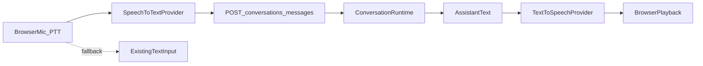

# Phase 2 — Browser Voice Plan

Planning document for optional browser-based voice interaction around the existing Phase 1 conversation core.

**Status:** Planning only. This document does **not** authorize implementation.

**Related:** [Implementation Roadmap](IMPLEMENTATION-ROADMAP.md)

---

## 1. Objective

Add optional browser-based voice interaction without changing or coupling the existing `ConversationRuntime`.

Phase 1 flow (unchanged):

```
Browser text input
  → POST /api/conversations/messages
  → ConversationRuntime
  → MockAIProvider
  → optional tool execution
  → assistant text response
```

Target Phase 2 flow:

```
Browser microphone (push-to-talk)
  → browser speech-to-text adapter
  → existing POST /api/conversations/messages
  → existing ConversationRuntime
  → assistant text
  → browser text-to-speech adapter
  → browser audio playback
```

Voice is a presentation/channel layer. The runtime remains text-in / text-out.

---

## 2. Architecture principles

| Principle | Requirement |
|-----------|-------------|
| Channel separation | Voice remains a presentation/channel layer outside `ConversationRuntime` |
| Text preservation | Text mode remains fully functional at all times |
| Stable entry point | Existing `POST /api/conversations/messages` remains the runtime entry point |
| No audio storage | No raw audio is persisted, uploaded, or logged |
| Interaction model | Push-to-talk only |
| No continuous listen | No background or always-on microphone capture |
| No telephony | Phone, SIP, and call bridging are out of Phase 2 |
| No external voice vendor (first slice) | First implementation uses browser-native capabilities where supported |
| Demo continuity | Keep fictional dental-clinic tenant and `MockAIProvider` |



### Relationship to the broader roadmap

[IMPLEMENTATION-ROADMAP.md](IMPLEMENTATION-ROADMAP.md) Phase 2 also mentions demo deployment profile packaging, public rate limiting, and an embeddable widget. **This first Phase 2 slice** deliberately focuses on browser voice on `/demo`. Deployment packaging, rate limiting, and widget work may follow after the voice path works.

---

## 3. Proposed contracts

> **Proposal only.** The TypeScript below is illustrative documentation. These interfaces are **not implemented** and must not be treated as existing source files.

### `SpeechToTextProvider`

```ts
/** PROPOSAL — not implemented */
interface SpeechToTextProvider {
  isSupported(): boolean;
  start(options?: { language?: string }): Promise<void>;
  stop(): Promise<string>; // final transcript (may be empty)
  abort(): Promise<void>;
  onPartial?(callback: (text: string) => void): void;
}
```

### `TextToSpeechProvider`

```ts
/** PROPOSAL — not implemented */
interface TextToSpeechProvider {
  isSupported(): boolean;
  speak(text: string, options?: { language?: string }): Promise<void>;
  stop(): Promise<void>;
  isSpeaking(): boolean;
}
```

### `VoiceCapability`

```ts
/** PROPOSAL — not implemented */
interface VoiceCapability {
  speechRecognition: boolean;
  speechSynthesis: boolean;
  microphone: "unknown" | "granted" | "denied" | "prompt";
  supported: boolean; // true when STT + TTS APIs are available enough for the voice path
}
```

### `VoiceSessionState`

```ts
/** PROPOSAL — not implemented */
type VoiceSessionState =
  | "idle"
  | "requesting-permission"
  | "listening"
  | "transcribing"
  | "sending"
  | "waiting-for-response"
  | "speaking"
  | "stopped"
  | "unsupported"
  | "error";
```

### `VoiceError`

```ts
/** PROPOSAL — not implemented */
interface VoiceError {
  code:
    | "unsupported"
    | "permission-denied"
    | "recognition-failed"
    | "empty-transcript"
    | "api-failed"
    | "playback-failed"
    | "aborted";
  message: string; // safe, user-facing, non-sensitive
  retryable: boolean;
}
```

Optional companion (future implementation detail, not required as a separate file yet):

```ts
/** PROPOSAL — not implemented */
interface AudioCaptureController {
  requestPermission(): Promise<"granted" | "denied">;
  start(): Promise<void>;
  stop(): Promise<void>;
  abort(): Promise<void>;
  isActive(): boolean;
}
```

---

## 4. State model

### States

| State | Meaning |
|-------|---------|
| `idle` | Ready; mic inactive; text input available |
| `requesting-permission` | Browser permission prompt in progress |
| `listening` | Push-to-talk active; capturing utterance |
| `transcribing` | Finalizing speech recognition result |
| `sending` | Posting transcript to conversation API |
| `waiting-for-response` | Awaiting assistant text from runtime |
| `speaking` | Playing assistant speech via TTS |
| `stopped` | User stopped recording or playback; safe to resume |
| `unsupported` | Browser/capabilities insufficient for voice path |
| `error` | Recoverable or terminal voice-path failure; text still available |

### Allowed transitions

```
idle → requesting-permission → listening → transcribing → sending → waiting-for-response → speaking → idle
idle → listening                         (permission already granted)
idle → unsupported
idle → error
listening → stopped
listening → error
listening → transcribing
transcribing → sending
transcribing → error
transcribing → idle                      (empty transcript → prompt user / stay text-capable)
sending → waiting-for-response
sending → error
waiting-for-response → speaking
waiting-for-response → idle              (TTS unsupported: show text only)
waiting-for-response → error
speaking → idle
speaking → stopped
speaking → error
stopped → idle
error → idle                             (Retry / Continue with text)
unsupported → idle                       (Continue with text; voice controls remain disabled)
* → idle                                 (Reset conversation cancels in-flight voice work)
```

### Invalid transitions (examples)

| Invalid | Why |
|---------|-----|
| `idle → speaking` | Nothing to speak until an assistant reply exists |
| `speaking → listening` | No barge-in / overlap in Phase 2 |
| `sending → listening` | Must finish or abort the current turn first |
| `unsupported → listening` | Capabilities missing |
| `waiting-for-response → listening` | One turn at a time |
| Any state → continuous listen loop | Continuous listening is forbidden |

---

## 5. User experience

| Control / element | Behavior |
|-------------------|----------|
| **Start speaking** | Begins push-to-talk after capability/permission checks |
| **Stop recording** | Ends capture and proceeds to transcription → API |
| **Stop playback** | Cancels TTS immediately; transcript remains |
| **Microphone / listening indicator** | Visible while `listening` (and clearly not active otherwise) |
| **Status text** | Human-readable voice status mapped from `VoiceSessionState` |
| **Text input** | Always available; never blocked by voice feature presence |
| **Retry** | Re-attempt last failed voice step when `retryable` |
| **Continue with text** | Leave voice path; keep session and transcript; focus text input |
| **Reset conversation** | Clears session/transcript and aborts listening/playback |

### Accessibility

- All voice controls are real `<button>` elements with clear labels.
- Status updates use an accessible live region (`aria-live`) without excessive chatter.
- Listening indicator is not color-only; include text (e.g. “Listening…”).
- Keyboard: Start/Stop/Retry/Continue/Reset operable without a pointer.
- Screen readers announce state changes for permission, listening, errors, and playback stop.
- When unsupported, announce that voice is unavailable and text mode remains available.

**Recommended placement:** keep voice controls on `/demo` beside the existing text simulator (not a separate `/voice-demo` route for the first slice).

---

## 6. Browser capability handling

### Detection

- **Speech recognition:** detect `SpeechRecognition` / `webkitSpeechRecognition` (or equivalent browser API) before enabling Start speaking.
- **Speech synthesis:** detect `window.speechSynthesis` and utterance support before auto-play.
- **Microphone permission:** request only on explicit Start speaking; reflect `granted` / `denied` / `prompt` in capability state.

### Unsupported-browser behavior

- Enter `unsupported` (or disable voice with clear status).
- Keep text simulator fully usable.
- Do not show a broken mic control without explanation.

### Known browser-specific limitations (document for implementers)

- Web Speech recognition support varies (Chromium generally stronger; Safari/Firefox support differs by version and OS).
- Recognition quality and language coverage are browser/OS dependent.
- Some browsers require a user gesture to start recognition or playback.
- Synthesis voices and latency vary; there is no guarantee of a consistent “receptionist” voice.
- HTTPS (or localhost) is typically required for microphone access.
- Recognition may be implemented via browser/OS services; Phase 2 still must not upload or persist raw audio in **this application**.

### Fallback to text mode

Fallback triggers:

- speech recognition unavailable
- speech synthesis unavailable (still allow STT → text reply without playback, or disable voice start if STT missing)
- microphone permission denied
- transcription failure / empty transcript
- audio playback failure

In all cases: show status, offer Retry and/or Continue with text, leave text input enabled.

---

## 7. Privacy and safety

| Rule | Detail |
|------|--------|
| Explicit activation | Microphone used only after Start speaking |
| No background listening | No always-on capture; push-to-talk only |
| No audio persistence | Do not save, download, or cache raw audio blobs in app storage |
| No recording uploads | Do not POST audio to the server; only text transcripts use the existing API |
| Transcript storage | Remains the existing in-memory demo conversation store |
| Redacted errors | User-facing errors omit stack traces, raw browser internals, and sensitive details |
| Fictional demo data | Dental-clinic fictional tenant and mock AI only |

---

## 8. Proposed file impact

Likely future files (**do not create in this planning step**):

| Path | Purpose |
|------|---------|
| `src/core/voice/types.ts` | Provider-neutral voice contracts |
| `src/adapters/voice/browser-speech-to-text.ts` | Browser-native STT adapter |
| `src/adapters/voice/browser-text-to-speech.ts` | Browser-native TTS adapter |
| `src/app/demo/use-voice-session.ts` | Demo voice state machine / orchestration hook |
| `src/app/demo/page.tsx` | Integrate optional voice controls; preserve text UI |
| `src/app/globals.css` | Voice status / indicator styles |
| Focused tests under `src/` | Capability detection, state transitions, fallbacks |
| `README.md` | Phase 2 voice demo notes |
| `docs/architecture/CALL-FLOW.md` | Document browser voice path |
| `docs/architecture/TARGET-ARCHITECTURE.md` | Update voice adapter status |
| `docs/roadmap/IMPLEMENTATION-ROADMAP.md` | Mark Phase 2 progress when implementation completes |

Unchanged by design in Phase 2 first slice:

- `src/core/runtime/conversation-runtime.ts` (no voice coupling)
- `MockAIProvider` wiring
- In-memory persistence
- Conversation API request/response shape (text only)

---

## 9. Implementation tasks

### Task 2.1 — Contracts and capability detection

| Field | Detail |
|-------|--------|
| **Objective** | Add voice type contracts and a pure capability-detection helper |
| **Likely files** | `src/core/voice/types.ts`; small detection helper + tests |
| **Completion criteria** | Types compile; detection reports recognition/synthesis/mic support without starting capture |
| **Risks** | Over-modeling APIs that differ across browsers |
| **Manual verification** | Load detection in supported and unsupported browsers; compare flags |
| **Rollback** | Delete `src/core/voice/` and tests; no runtime behavior change if unused |

### Task 2.2 — Browser speech-to-text adapter

| Field | Detail |
|-------|--------|
| **Objective** | Implement push-to-talk STT adapter behind `SpeechToTextProvider` |
| **Likely files** | `src/adapters/voice/browser-speech-to-text.ts` + tests |
| **Completion criteria** | Start/stop/abort; returns final transcript string; no audio upload |
| **Risks** | Vendor-prefixed APIs; flaky final-result events |
| **Manual verification** | Speak a short phrase; confirm transcript text only |
| **Rollback** | Remove adapter file; leave demo on text-only path |

### Task 2.3 — Browser text-to-speech adapter

| Field | Detail |
|-------|--------|
| **Objective** | Implement TTS adapter behind `TextToSpeechProvider` with stop/cancel |
| **Likely files** | `src/adapters/voice/browser-text-to-speech.ts` + tests |
| **Completion criteria** | Speaks assistant text; `stop()` cancels immediately; `isSpeaking()` accurate |
| **Risks** | Autoplay policies; voice inventory differences |
| **Manual verification** | Play and stop mid-utterance |
| **Rollback** | Remove adapter; demo shows text without speech |

### Task 2.4 — Demo UI integration

| Field | Detail |
|-------|--------|
| **Objective** | Wire voice controls into `/demo` without removing text simulator |
| **Likely files** | `src/app/demo/use-voice-session.ts`, `src/app/demo/page.tsx`, `src/app/globals.css` |
| **Completion criteria** | PTT → API → transcript update → auto TTS; text input still works independently |
| **Risks** | State races between text send and voice send |
| **Manual verification** | Full happy-path voice turn on fictional dental tenant |
| **Rollback** | Revert demo UI/hook changes; restore text-only controls |

### Task 2.5 — Fallback and error handling

| Field | Detail |
|-------|--------|
| **Objective** | Map failures to safe states and user actions (Retry / Continue with text) |
| **Likely files** | `use-voice-session.ts`, demo page copy/status UI |
| **Completion criteria** | Permission denial, unsupported, empty transcript, API failure, playback failure all degrade to text |
| **Risks** | Error loops; unclear status messaging |
| **Manual verification** | Deny mic; disable recognition (or unsupported browser); force API error |
| **Rollback** | Remove fallback branches only if feature flag/guard disables voice entirely |

### Task 2.6 — Tests and documentation closeout

| Field | Detail |
|-------|--------|
| **Objective** | Lock behavior with tests; update public docs to match implementation |
| **Likely files** | Focused Vitest files; README; CALL-FLOW; TARGET-ARCHITECTURE; IMPLEMENTATION-ROADMAP |
| **Completion criteria** | Documented test strategy covered; lint/typecheck/test/build pass; docs consistent |
| **Risks** | Doc drift; brittle browser API mocks |
| **Manual verification** | Run validation suite; walk `/demo` text + voice paths |
| **Rollback** | Revert doc/status claims if feature incomplete |

---

## 10. Testing strategy

| Scenario | Expected result |
|----------|-----------------|
| Supported browser | Voice controls enabled after capability check |
| Unsupported browser | `unsupported` (or disabled controls) + text mode works |
| Permission granted | Transition to `listening` on Start speaking |
| Permission denied | `error` / denied status; Continue with text works |
| Successful transcription | Transcript becomes user message; API called |
| Empty transcription | No misleading send; user prompted; stay text-capable |
| Recognition failure | Safe error; Retry / Continue with text |
| API failure | Safe error; transcript UX does not claim success |
| Speech playback | Assistant text spoken after voice turn |
| Playback cancellation | Stop playback ends audio; text remains |
| Reset during listening | Capture aborted; session/transcript cleared per reset rules |
| Reset during playback | Playback stopped; session/transcript cleared |
| Continued text-mode operation | Typing/sending works with voice idle, unsupported, or after errors |

Prefer Vitest unit/integration tests with mocked browser APIs. Do not add new test-framework dependencies for the first slice unless separately approved.

---

## 11. Decisions requiring approval

Recommended decisions for Phase 2 first implementation (approve before Task 2.1):

| Decision | Recommendation |
|----------|----------------|
| Voice control placement | Keep voice controls on `/demo` |
| Interaction model | Use push-to-talk |
| Playback policy | Automatically play assistant speech after a voice turn |
| Playback control | Provide Stop playback |
| Text availability | Keep text input enabled |
| STT/TTS technology | Use browser-native speech APIs initially |
| Dependencies | Add no external packages initially |
| AI provider | Keep `MockAIProvider` during Phase 2 |
| Persistence | Keep persistence in memory during Phase 2 |

---

## 12. Out of scope

Phase 2 (this slice) does **not** include:

- SIP
- Phone numbers / telephony adapters
- Vapi
- OpenAI Realtime
- External STT/TTS provider SDKs
- Barge-in
- Continuous conversation / always-on listening
- Call transfer
- Call/audio recordings
- PostgreSQL or durable persistence
- Authentication
- Production deployment hardening (rate limiting, public abuse controls, embeddable widget packaging)

---

## Closing

### Recommended first implementation task

**Task 2.1 — contracts and capability detection** (after approval of Section 11 decisions).

### Expected package additions

**None.** Prefer browser-native Web Speech APIs and existing Next.js/React stack only.

### Known browser limitations

- Uneven STT support across browsers and platforms
- TTS voice quality/consistency varies
- Permission and autoplay restrictions
- Recognition may depend on browser/OS services outside app control
- Not a substitute for production telephony or managed voice infrastructure

### Phase 2 completion criteria (first slice)

- Push-to-talk capture on a supported browser produces a transcript
- Transcript uses existing `POST /api/conversations/messages`
- Assistant reply appears in the existing `/demo` transcript UI
- Assistant reply can be spoken via browser TTS with Stop playback
- Text simulator remains fully usable with graceful voice fallbacks
- No raw audio persistence or upload
- No telephony and no external voice SDKs
- Fictional dental tenant + `MockAIProvider` unchanged
- Docs updated to match implemented behavior

### Authorization notice

**This document is a plan only.** It does **not** authorize Phase 2 implementation, dependency installation, or telephony work. Implementation requires an explicit follow-up instruction after the decisions in Section 11 are approved.
